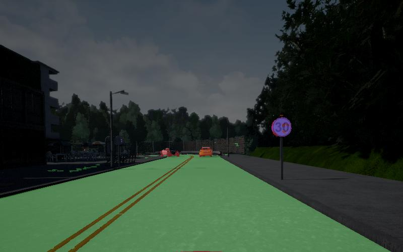

# Semantic Segmentation tutorial

This is a tutorial to demonstrate how to perform semantic segmentaiotn on images with deep learning in a few lines of code.

Data is collected from the self-driving car simulator [Carla simulator](http://carla.org/). The data is included in the repository for the tutorial. Nevertheless, make sure to check this cool open-sourced simulator if you are interested to explore more different topics in perceptions for self-driving car

The tutorial material is inside the jupyter notebook. The training data is included (data.hdf5.zip, remember to extract it). A pre-trained model is also included for benchmarking.
